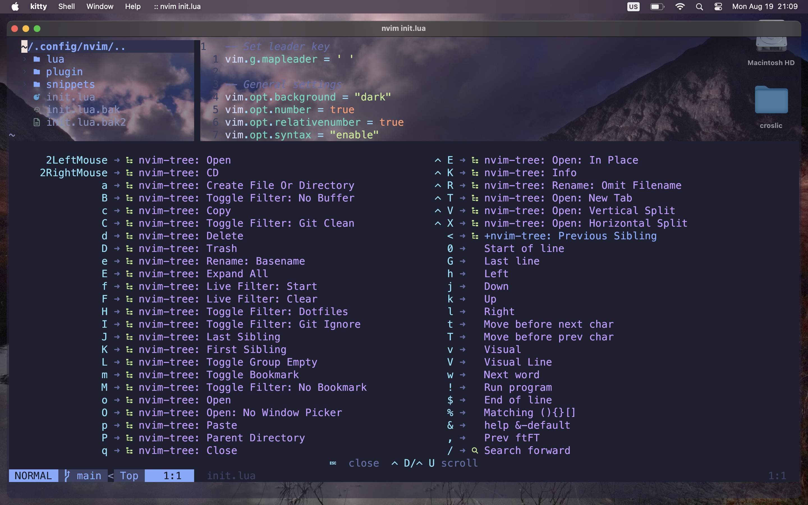

# macOS Customization with Kitty, Yazi, Nvim, and Yabai


Welcome to the ultimate guide for transforming your macOS environment using some of the best tools out there. This repository provides everything you need to customize and theme macOS while using the **Kitty** terminal emulator, **Yazi** file manager, **Neovim** as your text editor, and **Yabai** for tiling window management.

---

## Screenshots

Take a look at what your `macOS` can look like after following this guide:




---

## Features


## <a href="https://github.com/kovidgoyal/kitty" style="font-size:24px; font-weight:bold;">Kitty Terminal Emulator</a>

 - Blazing fast and highly customizable `terminal`.
  - Beautiful color schemes that integrate seamlessly with your macOS theme.

## <a href="https://yazi-rs.github.io/" style="font-size:24px; font-weight:bold;">Yazi File Manager</a>
  - A modern, fast, and minimalistic `file manager`.
  - Highly configurable with advanced theming options.

## <a href="https://neovim.io/" style="font-size:24px; font-weight:bold;">Neovim (Nvim) Editor</a>
  - A hyper-extensible and fast text editor.
  - Powerful plugins and themes to match the macOS aesthetic.

## <a href="https://github.com/koekeishiya/yabai" style="font-size:24px; font-weight:bold;">Yabai Tiling Window Manager</a>
  - A powerful and flexible tiling window manager for macOS.
  - Make your workflow efficient with custom tiling layouts.

---

## Installation Guide

### 1. Install homebrew

## <a href="https://brew.sh/" style="font-size:24px; font-weight:bold;">Homebrew</a>

Run the following command:

```bash
/bin/bash -c "$(curl -fsSL https://raw.githubusercontent.com/Homebrew/install/HEAD/install.sh)"
```

Add To Path `(Only Apple Silicon Macbooks)`
After installing, add it to the path. This step shouldn’t be necessary on Intel macs.

Run the following command to add the necessary line to `~/.zprofile`:

```bash
echo 'eval "$(/opt/homebrew/bin/brew shellenv)"' >> ~/.zprofile
```

Now source `~/.zprofile` by doing:

```bash
source ~/.zprofile
```

### essential brew commands
```bash
brew upgrade
brew upgrade --cask
brew update
brew cleanup
brew doctor
brew list --version
brew uninstall [...]
brew services list
```

##Installation of homebrew essentials

## Setting Up Kitty

Follow these steps to install and configure Kitty:

1. Install Kitty via Homebrew:

```bash
   brew install kitty
```
**Set up kitty theme**

```bash
kitten theme
```

## Setting Up NVim
```bash
   brew install nvim
```


### Install Tiling Window Manager - Yabai

```bash
brew install koekeishiya/formulae/yabai
```

### Install SKHD

```bash
brew install koekeishiya/formulae/skhd  
```

### Install File Manager - Yazi

```bash
brew install yazi
```

### Install Fastfetch

```bash
brew install fastfetch  
```


### Install Unar (unrar)
```bash
brew install unar
```

### Install Lazygit
```bash
brew install lazygit
```

### Install git

```bash
brew install git
```

### essential git commands
```bash
git add .
git status
git commit -m "[...]"
git push -u origin main
```

### Install fzf (command line fuzzy finder)
`fzf` is an amazing fuzzy finder for the command line.

Install `fzf` with `homebrew`:

```bash
brew install fzf
```
open ~/.zshrc

```bash
nvim ~/.zshrc
```
add:

```bash
# ---- FZF -----
# Set up fzf key bindings and fuzzy completion
eval "$(fzf --zsh)"
```

```bash
source ~/.zshrc
```
Now you can use fzf!

Examples of what you can do with it:


| Key Combination                                 | Description                                       |
|-------------------------------------------------|---------------------------------------------------|
| `CTRL-t`                                        | Look for files and directories                    |
| `CTRL-r`                                        | Look through command history                      |
| `Enter`                                         | Select the item                                   |
| `Ctrl-j` or `Ctrl-n` or `Down arrow`            | Go down one result                                |
| `Ctrl-k` or `Ctrl-p` or `Up arrow`              | Go up one result                                  |
| `Tab`                                           | Mark a result                                     |
| `Shift-Tab`                                     | Unmark a result                                   |
| `cd **Tab`                                      | Open up fzf to find directory                     |
| `export **Tab`                                  | Look for env variable to export                   |
| `unset **Tab`                                   | Look for env variable to unset                    |
| `unalias **Tab`                                 | Look for alias to unalias                         |
| `ssh **Tab`                                     | Look for recently visited host names              |
| `kill -9 **Tab`                                 | Look for process name to kill to get pid          |
| Any command (like `nvim` or `code`) + `**Tab`   | Look for files & directories to complete command  |


### Use fd with fzf
`fzf` by default uses the find command to look for files and directories.

Let’s replace that with `fd` for better functionality, like ignoring files ignored by git (with .gitignore).

Install `fd`:

```bash
brew install fd
```

```bash
nvim ~/.zshrc
```
Add to the bottom of this file: (theme also included)

```bash
# -- Use fd instead of fzf --

export FZF_DEFAULT_COMMAND="fd --hidden --strip-cwd-prefix --exclude .git"
export FZF_CTRL_T_COMMAND="$FZF_DEFAULT_COMMAND"
export FZF_ALT_C_COMMAND="fd --type=d --hidden --strip-cwd-prefix --exclude .git"

# Use fd (https://github.com/sharkdp/fd) for listing path candidates.
# - The first argument to the function ($1) is the base path to start traversal
# - See the source code (completion.{bash,zsh}) for the details.
_fzf_compgen_path() {
  fd --hidden --exclude .git . "$1"
}

# Use fd to generate the list for directory completion
_fzf_compgen_dir() {
  fd --type=d --hidden --exclude .git . "$1"
}

# --- setup fzf theme ---
fg="#CBE0F0"
bg="#011628"
bg_highlight="#143652"
purple="#B388FF"
blue="#06BCE4"
cyan="#2CF9ED"

export FZF_DEFAULT_OPTS="--color=fg:${fg},bg:${bg},hl:${purple},fg+:${fg},bg+:${bg_highlight},hl+:${purple},info:${blue},prompt:${cyan},pointer:${cyan},marker:${cyan},spinner:${cyan},header:${cyan}"

```

After saving, in your terminal do:

```bash
source ~/.zshrc
```

### bat (better cat)
bat is a really nice alternative to cat to display file contents in the terminal with syntax highlighting.

```bash
brew install bat
```

Now you can start using it!

Example:

bat filename.txt
The example above would print out the contents of a file called filename.txt.

To see examples of all of the themes you can use:

```bash
bat --list-themes | fzf --preview="bat --theme={} --color=always /path/to/file"
```
Make sure to replace /path/to/file with the path to an actual file.

Install a custom theme
If you find a theme on github for example, you can follow these steps.

The first time you do this create the following directory:

```bash
mkdir -p "$(bat --config-dir)/themes"
```

Then move into it:

```bash
cd "$(bat --config-dir)/themes"
```

Then you can download the file for the theme you want to use into this directory.

The file should use the `.tmTheme` extension.

For example:

```bash
curl -O https://raw.githubusercontent.com/folke/tokyonight.nvim/main/extras/sublime/tokyonight_night.tmTheme
```

This will install the night version of the `tokyonight` theme.

Then to use it run:

```bash
bat cache --build
```

And then add the following to your `~/.zshrc`:

```bash
# ----- Bat (better cat) -----

export BAT_THEME=tokyonight_night
```

Replace `tokyonight_night` with the name of the theme you would like to use.

Then save this file and run:

```bash
source ~/.zshrc
```

## tldr (user-friendly man pages)
tldr is a huge collection of community maintained help pages with helpful summaries for `cli tools`. You can use this as an alternative to man pages.

Install the rust client with homebrew:

```bash
brew install tlrc
```

Now you can use it just like man to learn more about a tool.

For example to learn more about `eza`:

```bash
tldr eza
```

## thefuck
thefuck is a really nice tool to auto correct mistyped commands.

```bash
brew install thefuck
```

Then open your `~/.zshrc` file and add:

```bash
# thefuck alias
eval $(thefuck --alias)
eval $(thefuck --alias fk)
```

This will setup the alias which is `fuck`.

Save your zshrc file and run:

```bash
source ~/.zshrc
```

Now if mistype a command you can run `fuck` or `fk` afterwards.

If there are is more than one result you can use your up and down arrow keys and then enter to select the one you want.

### Install Meslo Nerd Font
**Nerd Fonts** are great for showing icons in the terminal. I personally use Meslo Nerd Font, but there are others.

You can install a nerd font with homebrew. Take a look at the fonts in the hombrew casks repo: **homebrew-cask**

It is no longer necessary to tap the homebrew-cask-fonts repo as the fonts have been added to homebrew-cask.

Then you can install the nerd font you’d like

```bash
brew install font-meslo-lg-nerd-font
```

### Install powerlevel10k theme
**Powerlevel10k** is an awesome theme for zsh.

   ```bash
brew install powerlevel10k
```
copy this into your file: `.zshrc`

```bash
#history setup
HISTFILE=$HOME/.zhistory
SAVEHIST=1000
HISTSIZE=999
setopt share_history
setopt hist_expire_dups_first
setopt hist_ignore_dups
setopt hist_verify

# completion using arrow keys (based on history)
bindkey '^[[A' history-search-backward
bindkey '^[[B' history-search-forward

# Enable zsh-autosuggestions
source $(brew --prefix)/share/zsh-autosuggestions/zsh-autosuggestions.zsh

# Enable zsh-syntax-highlighting
source $(brew --prefix)/share/zsh-syntax-highlighting/zsh-syntax-highlighting.zsh

# ---- Eza (better ls) -----
alias ls="eza --icons=always"

# ---- Zoxide (better cd) ----
eval "$(zoxide init zsh)"
alias cd="z"
```


Then run the following:

   ```bash
echo "source $(brew --prefix)/share/powerlevel10k/powerlevel10k.zsh-theme" >> ~/.zshrc
```

The `powerlevel10k` configuration wizard should show up now.

If you want to open the wizard `manually` do:

```bash
p10k configure
```

Answer the prompts to make the theme look like you would like it to. For the colors of my coolnight theme to work use either lean (with the 8 colors option) or rainbow.

### Better zsh history completion with up, down arrows
Let’s improve the history completion with the up and down arrows.

Open `~/.zshrc` and add the following to the bottom of this file:

```bash
HISTFILE=$HOME/.zhistory
SAVEHIST=1000
HISTSIZE=999
setopt share_history
setopt hist_expire_dups_first
setopt hist_ignore_dups
setopt hist_verify
```

This will allow zsh to save the history to a file and configure how it should do so.

Then go back to the command line and run:


```bash
cat -v
```
Now press on your `up` and `down` `arrow` keys.

Copy the codes that you get as output.

Open the `~/.zshrc` file again and add the following to the bottom of this file:

```bash
# completion using arrow keys (based on history)
bindkey '^[[A' history-search-backward
bindkey '^[[B' history-search-forward
```

***Setup zsh-autosuggestions plugin***
This plugin provides some really nice auto completion functionality as you type out commands.

```bash
brew install zsh-autosuggestions
```

Now you can use the plugin! When you get a suggestion and want to use it, use the right arrow key.

***Setup zsh-syntax-highlighting***
This will provide some really nice syntax highlighting as you type out commands.

```bash
brew install zsh-syntax-highlighting
```

You should be getting the syntax highlighting now!


***Install eza (better ls)***
eza is a better version of ls with lots of different options.

Install it:

```bash
brew install eza
```

Now you can start using it!

### Setup fzf previews
Now that you have eza and bat setup you can setup some really nice previews for fzf.

In your `~/.zshrc`, where you’re configuring fzf, add the following:

```bash
export FZF_CTRL_T_OPTS="--preview 'bat -n --color=always --line-range :500 {}'"
export FZF_ALT_C_OPTS="--preview 'eza --tree --color=always {} | head -200'"

# Advanced customization of fzf options via _fzf_comprun function
# - The first argument to the function is the name of the command.
# - You should make sure to pass the rest of the arguments to fzf.
_fzf_comprun() {
  local command=$1
  shift

  case "$command" in
    cd)           fzf --preview 'eza --tree --color=always {} | head -200' "$@" ;;
    export|unset) fzf --preview "eval 'echo $'{}"         "$@" ;;
    ssh)          fzf --preview 'dig {}'                   "$@" ;;
    *)            fzf --preview "bat -n --color=always --line-range :500 {}" "$@" ;;
  esac
}
```

This will setup file previews with bat as well as directory previews with eza and some other previews as well.

There is one slight issue with this code though. When we are looking for files and directories with Ctrl-T or doing something like nvim **Tab, we are using bat to generate the preview but this won’t work for directories and we’ll get an error.

We can fix this by using an if statement that checks whether the path to what we should preview is a directory or not and use eza instead for the preview in this case.

To do this you can replace the previous code with something like the following:

```bash
show_file_or_dir_preview="if [ -d {} ]; then eza --tree --color=always {} | head -200; else bat -n --color=always --line-range :500 {}; fi"

export FZF_CTRL_T_OPTS="--preview '$show_file_or_dir_preview'"
export FZF_ALT_C_OPTS="--preview 'eza --tree --color=always {} | head -200'"

# Advanced customization of fzf options via _fzf_comprun function
# - The first argument to the function is the name of the command.
# - You should make sure to pass the rest of the arguments to fzf.
_fzf_comprun() {
  local command=$1
  shift

  case "$command" in
    cd)           fzf --preview 'eza --tree --color=always {} | head -200' "$@" ;;
    export|unset) fzf --preview "eval 'echo ${}'"         "$@" ;;
    ssh)          fzf --preview 'dig {}'                   "$@" ;;
    *)            fzf --preview "$show_file_or_dir_preview" "$@" ;;
  esac
}
```

***Install zoxide (better cd)***
`zoxide` is an amazing alternative to `cd`.

It will remember the directories you’ve visited in the past and make it really easy to navigate back to them by just typing out a portion of the name of the directory you want to visit.

```bash
brew install zoxide
```

If you want to keep using cd then create an `alias` in `~/.zshrc`:

```bash
# ---- Zoxide (better cd) ----
eval "$(zoxide init zsh)"
alias cd="z"
```

Save and then run:

```bash
source ~/.zshrc
```

Now you can use z as a much smarter replacement to `cd`.

If you want to trigger fzf when you’re moving to a directory with `z` you can do `space` + `tab`.

Done!
